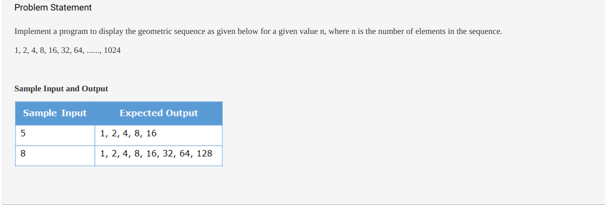

# Programming using Java
## Iteration control structure excercise
### Excercise 1:

Solution :
```
class Tester {
	public static void main(String[] args) {
		// Implement your code here
		int a = 8;
		int num = 1;
		System.out.print("1 ");
		for(int i =0;i<a-1;i++)
		{
		  num = num*2;
		  System.out.print(num+" ");
		}
		System.out.println("");
	}
}

```
